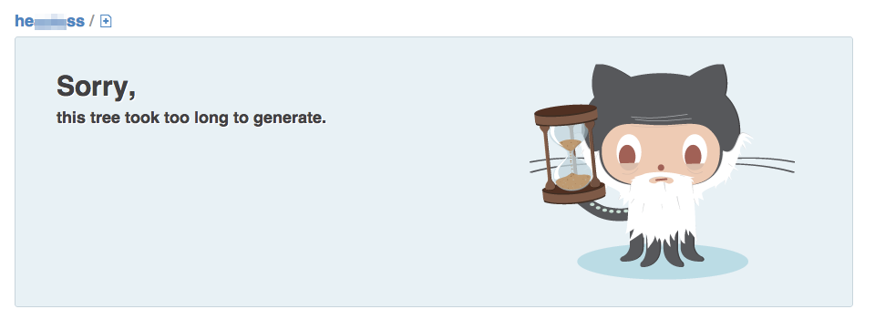

# Transparent Circuit Breaker
[http://github.com/transparentjs/transparent-circuit-breaker][self]

Transparent Circuit Breaker helps you keep your app stable. When one of your app's [backing services][backing]—like your API server—starts to fail, the breaker automatically executes a fallback path instead of continuing to call that service. The next set of calls made to that service will immediately use the fallback routine. After a timeout, the breaker will retry the service again. If successful it will re-enable use of the service again, and if not it will set another retry timeout.

Github employs this pattern when it takes too long for it to load your repo's file list, and it simply covers it up with a graphic like so: 

[self]: http://github.com/transparentjs/transparent-circuit-breaker
[backing]: http://www.12factor.net/backing-services

## How to Use It

Add it to your app's dependencies, then choose an approach below.

```console
# npm install --save transparent-circuit-breaker
```

### Put Breakers on Exported Methods, Use Default Values

By far the easiest way to use circuit breakers, you get a client object which will wrap
your real client and implement all the default approaches to resource failures.

```js
// app.js
var client = require('transparent-circuit-breaker')('real-api-client');

// uses an API client to get a value
exports.readAPICall = function(done) {
  client.getValue(function(err, value) {
    done(null, value);
  });
};

// uses an API client to update a value
exports.updateAPICall = function(newValue, done) {
  client.updateFoo({ foo: newValue }, function(err) {
    done(err);
  });
};
```

### Custom Circuit Breaker Config, Shared Across Your App

Each file in your app can require your module which sets up and
configures the appropriate circuit breakers around your API client
methods. This leaves the core API client module untouched for raw use
by other pieces of your app, but enables consistency within your app
because it centralizes how a particular API's breakers are set.

```js
// app.js
var client = require('./breakered-api-client');

// uses an API client to get a value
exports.readAPICall = function(done) {
  client.getValue(function(err, value) {
    done(null, value);
  });
};

// uses an API client to update a value
exports.updateAPICall = function(newValue, done) {
  client.updateFoo({ foo: newValue }, function(err) {
    done(err);
  });
};
```

```js
// breakered-api-client.js
var real = require('real-api-client')
  , cache = require('real-cache-client')
  , circuit = require('transparent-circuit-breaker');

// Export a proxy object for the real api module
// Select which methods you'll add circuit breakers to.
var client = module.exports = circuit.breaker(real, ['getValue', 'updateFoo']);

// Choose a fallback approach (default: throw). Last one wins.

// Use a custom error
client.getValue
  .when('failing').throw(new Error("Can't call getValue()!!"));

// Use EventEmitter with custom event. (default: failing)
client.getValue
  .when('failing').emit('fallback');

// Silent failure.
client.getValue
  .when('failing').return(null);

// Fallback to custom cache
client.getValue
  .when('failing').use(cache.getValue);
```

### Custom Circuit Breaker Config, This File Only

Usually you don't want to do this.

```js
// app.js
var client = require('transparent-circuit-breaker')('real-api-client');

// Silent failure.
client.getValue
  .when('failing').return(null);

// uses an API client to get a value
exports.readAPICall = function(done) {
  client.getValue(function(err, value) {
    done(null, value);
  });
};

// uses an API client to update a value
exports.updateAPICall = function(newValue, done) {
  client.updateFoo({ foo: newValue }, function(err) {
    done(err);
  });
};
```

## Background

Failing servers typically slow down, increase the rate at which they return errors, and eventually stop responding altogether. Right along with that failing server, your entire application may start to slow down, randomly display error pages, and eventually stop responding—even if that failing service is used by only a small portion of your app. Circuit breakers protect your application in the same way that the circuit breakers in a home protect its power system: they prevent failures in one area from causing failures everywhere in the system.

*Tripping the breaker* like this alleviates the load on the failing service, giving it time to recover—and selects a known approach for handling that failure within your application.

The circuit breaker pattern originates from [Michael Nygard][nygard]’s book _[Release It! Design and Deploy Production-Ready Software][release-it]_ and discussed in his _[Stability Patterns][stability]_.

[release-it]: http://pragprog.com/book/mnee/release-it
[stability]: http://www.slideshare.net/justindorfman/stability-patterns-presentation
[nygard]: http://twitter.com/mtnygard

### How it works

Circuit breakers need to insert themselves into the middle of requests to external resources. Those resources may be accessed in vastly different ways, but this module provides the basic pattern for interacting with circuit breakers. It plays off the work by the [Netflix team][netflix] in this area, providing various kinds of fallback options which can be set for a given circuit breaker, as well as a  general approach for reporting circuit breaker status and setting default timespans for state transitions and error conditions.

Circuit breakers for specific services (like PostgreSQL or MongoDB) or particular types of service access (like HTTP with standard response codes) are provided in separate modules conforming to this pattern in the style of PassportJS.

[netflix]: http://techblog.netflix.com/2011/12/making-netflix-api-more-resilient.html
